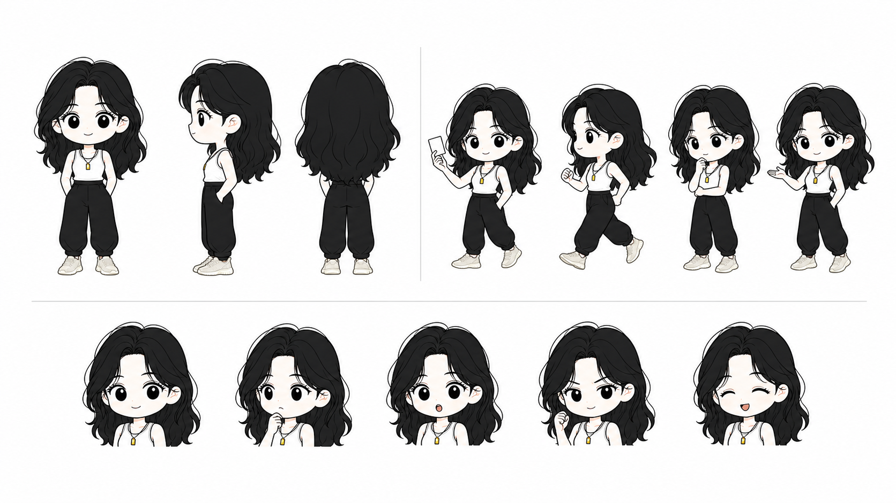
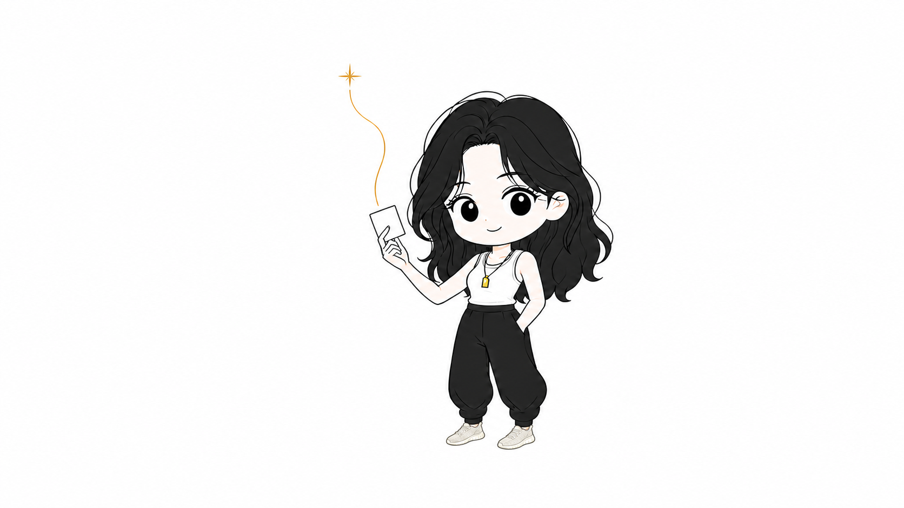

# Xiaoxin Personal IP Illustrations

为 Star 的中文述职、文章和解释型内容生成具有个人识别度的 Q 版配图。

这套 skill 使用一个小只但有行动力的成年女性 IP：八字刘海长黑发、白色黑边背心、高腰黑色镰刀裤、黑绳金色吊坠，以及小比例乳白色网面运动鞋。画面默认采用纯白 16:9 横版、简洁黑色线稿和克制的暖金色强调。

## 视觉原则

- 人物是解决问题的人，不是贴在角落的装饰。
- 一张图只表达一个判断、动作或隐喻。
- 卡片—金线—闪光只用于“连接与交付”，不是固定模板。
- 其他内容可使用桥、踏脚石、线团、岔路、灯或镜片等更合适的隐喻。
- 不画成技术老匠人、通用工程师、办公室套装女性或儿童吉祥物。

## 基准图

### 人物设定页



### 单个夏季 IP 形象



## 安装

```bash
git clone git@github.com:starshards/xiaoxin.git
mkdir -p "${CODEX_HOME:-$HOME/.codex}/skills/star-personal-ip-illustrations"
rsync -a --delete \
  ./xiaoxin/star-personal-ip-illustrations/ \
  "${CODEX_HOME:-$HOME/.codex}/skills/star-personal-ip-illustrations/"
```

安装后可直接使用：

```text
Use $star-personal-ip-illustrations 为这份中文述职生成一张使用我的个人 IP 的正文配图。
```

## 目录

```text
star-personal-ip-illustrations/
├── SKILL.md
├── agents/
├── assets/
│   ├── star-ip-character-sheet.png
│   ├── star-summer-ip-reference.png
│   ├── star-summer-ip-single.png
│   └── examples/star/
└── references/
```

## 来源与许可

本项目 fork 自 [helloianneo/ian-xiaohei-illustrations](https://github.com/helloianneo/ian-xiaohei-illustrations)，在保留原许可证和署名的基础上，人物、视觉规则、提示模板与基准图片已经改造成 Star 的个人版本。详见 [NOTICE.md](NOTICE.md) 和 [UPSTREAM_README.md](UPSTREAM_README.md)。
